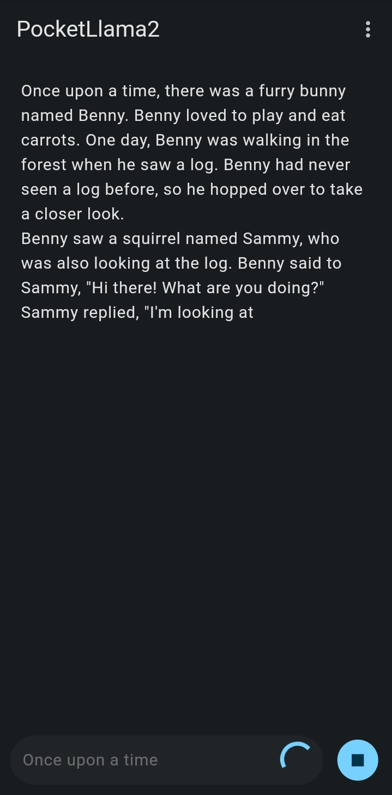

[PocketLlama2](https://github.com/mrunix00/pocketllama2) is a mobile app for text 
generation inference with Llama 2, based on [llama2.c's Dart port](https://github.com/yiminghan/llama2.dart).

This app allows you to use tiny Llama 2 AI models locally on your phone without the 
need for remote servers or crazy hardware specs.




