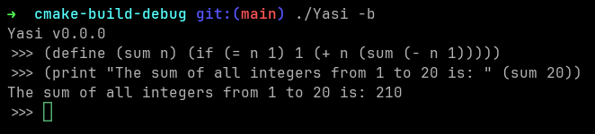

[Yasi](https://github.com/mrunix00/Yasi) is my own implementation of the 
[Scheme](https://en.wikipedia.org/wiki/Scheme_(programming_language)) dialect of
the [Lisp programming language](https://en.wikipedia.org/wiki/Lisp_(programming_language)),
written from scratch in C++.

## Roadmap

- [x] REPL Loop
- [x] Load and execute files
- [x] Basic arithmetic operations (+-*/)
- [x] Print statement
- [ ] Input statement
- [x] Variables
- [x] Conditional statements
- [x] Functions
- [x] Lambda functions
- [ ] Lists
- [ ] Macros
- [ ] Load and execute libraries
- [ ] Mathematical functions (sin, cos, tan, etc.)
- [x] Compilation to bytecode
- [x] Bytecode execution
- [ ] Bytecode optimization
- [ ] Tail call optimization
- [ ] Error handling (WIP)
- [ ] Garbage collection
- [ ] Windows Support